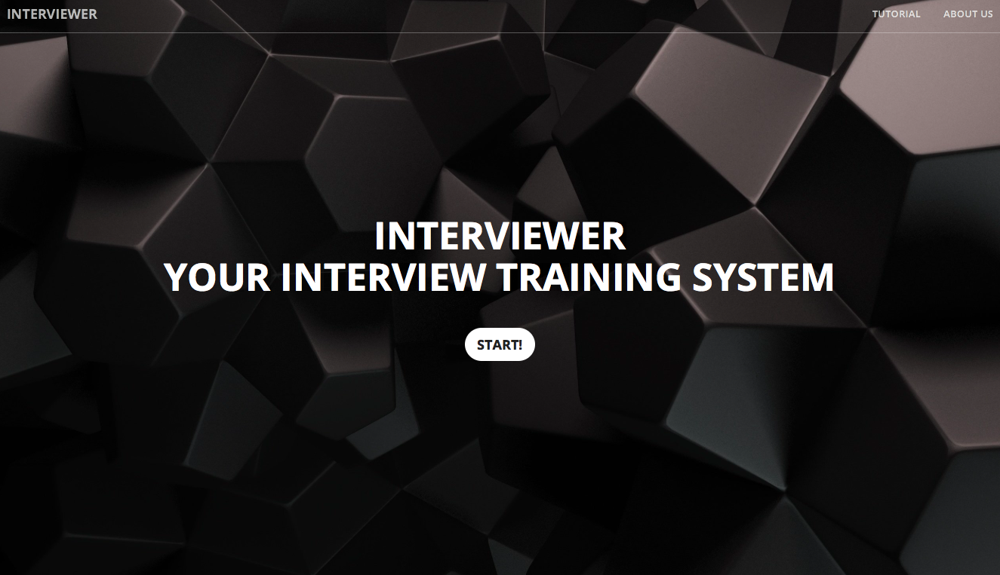

# Interview-Training-System
A project for the course "Building an intelligent dialog system". This is a simulation for college graduate interviews.  
The grading scheme is based on the interviewee's grammatical mistakes, confidence, and personality analyzed from the video record. 
There will be a downloadable pdf report about the suggested improvements and the overall score of this interview, and the user will receive an email regarding his/her application status soon after the interview. 
For more details, see our [Software Requirements Specifications Document](http://docdro.id/7ZRXPij).

#### Note that a video of the interviewee throughout the interview process will be recorded for analysis.  

## Technology
1. Facial recognition
2. Speech recognition
3. Emotion analysis of nervousness from audio and behavior
4. Characteristic analysis from audio and behavior

## Demo
Available [here](https://interview-training-system.herokuapp.com) on heroku, or see it on [youtube](https://www.youtube.com/watch?v=FwZaa4B095Q).  

### Screenshot

## Usage
1. Install the dependecies
`npm install`
2. Start this project! :)
`npm start`

